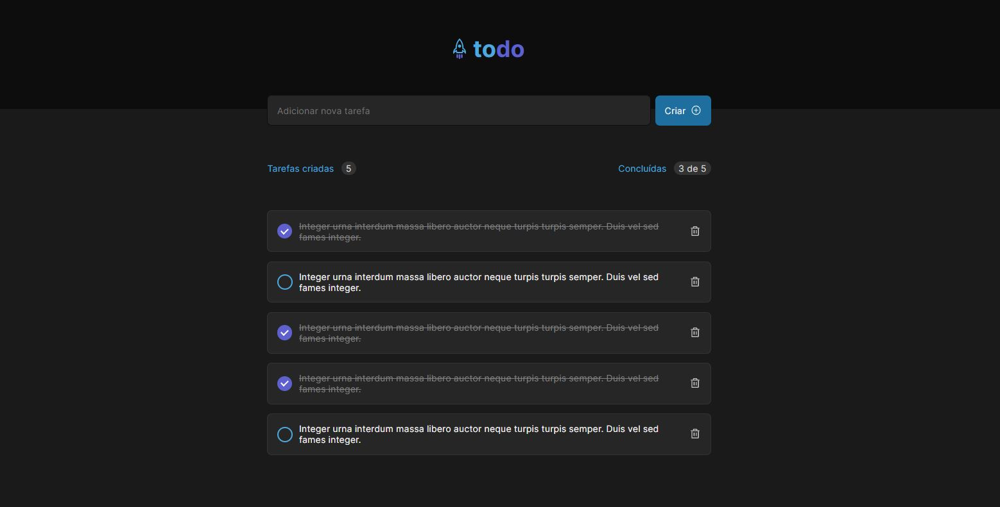

# Desafio Ignite

  

## 💻 Sobre o projeto

---

<a href="#" target="_blank">Versão online</a>

Desafio Rocketseat - Ignite ReactJs .

## 🚀 Tecnologias

---

Esse projeto foi desenvolvido com as seguintes tecnologias:

- ReactJS (create vite@latest)
- Typescript
- Deploy realizado na Vercel

### Rodando localmente

---

1. Instalar todos os pacotes com `yarn install`
2. Executar o comando `yarn dev`
3. Em alguns seguntos a URL: `http://localhost:3000/` ficará disponível
